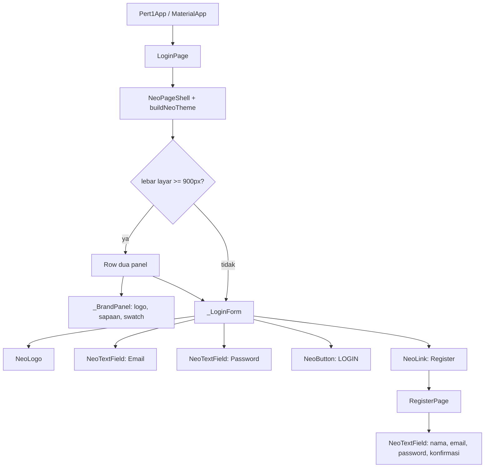

# Tugas Pertemuan 1 — Halaman Login Flutter (Neo Brutalism)

Halaman antarmuka **Login** untuk aplikasi Flutter, dibuat dengan gaya visual
**neo brutalism** berpalet biru. Sesuai ketentuan tugas, halaman ini **statis**:
tidak ada proses autentikasi, validasi, maupun koneksi ke server.

| | |
|---|---|
| Nama | TariqRahmadari |
| GitHub | [@ZeaLIsHere](https://github.com/ZeaLIsHere) |
| Repository | [Tugas1PM5](https://github.com/ZeaLIsHere/Tugas1PM5) |
| Mata kuliah | Pemrograman Mobile |
| Tugas | Pertemuan 1 |

## Ketentuan tugas dan implementasinya

| Ketentuan | Implementasi |
|---|---|
| Dua kolom input (email dan password) | `NeoTextField` untuk **Email** dan **Password** di `_LoginForm` (`lib/pages/login_page.dart`) |
| Satu tombol "Login" | `NeoButton` berlabel `LOGIN`, lengkap dengan efek pressed |
| Teks tautan ke halaman Register di bawah tombol | `NeoLink` berlabel `Register` → membuka `RegisterPage` |
| Halaman statis tanpa fungsionalitas | `onPressed: () {}` dan tanpa controller/validasi, murni tata letak |
| Desain neo brutalism | Seluruh warna, ukuran, dan bayangan diambil dari satu sumber token di `lib/theme/neo_theme.dart` |

Detail tambahan:

- Password disembunyikan (`obscureText`) dan bisa dilihat sementara lewat ikon mata.
- Field menampilkan bayangan biru saat sedang fokus.
- Responsif: pada lebar layar >= 900px tampil panel brand biru di samping form, di layar kecil panel tersebut disembunyikan dan hanya kartu form yang tampil.

## Gaya neo brutalism

Token di `lib/theme/neo_theme.dart` adalah hasil konversi dari variabel CSS neo
brutalism ke `Color`/`TextStyle` Flutter:

| Token | Nilai | Pemakaian |
|---|---|---|
| `NeoColors.background` | `hsl(214, 95%, 93%)` → `#DCEBFE` | latar halaman |
| `NeoColors.secondaryBackground` | putih → `#FFFFFF` | kartu, field, logo |
| `NeoColors.main` | `hsl(217, 100%, 66%)` → `#5294FF` | tombol, panel brand, bayangan saat fokus |
| `NeoColors.foreground` / `border` / `ring` | hitam → `#000000` | teks dan garis tepi |
| `NeoColors.overlay` | hitam 80% → `#000000CC` | disiapkan untuk dialog/overlay |
| `chart-1` … `chart-5` | `#5294FF`, `#FF4D50`, `#FACC00`, `#05E17A`, `#7A83FF` | swatch dekoratif |
| Bayangan | `4px 4px 0 0 #000000` | bayangan keras tanpa blur (`blurRadius: 0`) |
| Radius | `5px` | sudut semua elemen |
| Garis tepi | `3px` | batas semua elemen |

Ciri khas neo brutalism yang dipakai: garis tepi hitam tebal, bayangan keras tanpa
blur, warna flat tanpa gradien, dan efek tekan/hover yang menggeser elemen sejauh
bayangannya sehingga terlihat "masuk" ke halaman.

## Struktur UI



## Struktur file

```
lib/
├── main.dart                  # Pert1App -> LoginPage
├── theme/
│   └── neo_theme.dart         # NeoColors, NeoMetrics, NeoText, buildNeoTheme()
├── widgets/                   # komponen neo brutalism yang dapat dipakai ulang
│   ├── neo_card.dart          # permukaan: border 3px + bayangan keras
│   ├── neo_button.dart        # tombol dengan efek pressed
│   ├── neo_text_field.dart    # input + label uppercase + bayangan saat fokus
│   ├── neo_link.dart          # teks tautan dengan highlight saat hover
│   ├── neo_logo.dart          # badge logo
│   └── neo_page_shell.dart    # scaffold terpusat + swatch warna
└── pages/
    ├── login_page.dart        # halaman utama tugas ini
    └── register_page.dart     # tujuan tautan "Register"
```

## Cara menjalankan

```sh
flutter pub get

# jalankan di Chrome
flutter run -d chrome

# atau target lain, misalnya Windows
flutter run -d windows

# pemeriksaan statis dan test
flutter analyze
flutter test
```

## Catatan

- Halaman sengaja statis sesuai ketentuan tugas, sehingga `onPressed` pada tombol
  memang dikosongkan dan tidak ada state autentikasi.
- Komponen di `lib/widgets/` tidak terikat pada halaman Login, jadi bisa dipakai
  kembali untuk halaman lain dengan token yang sama.
